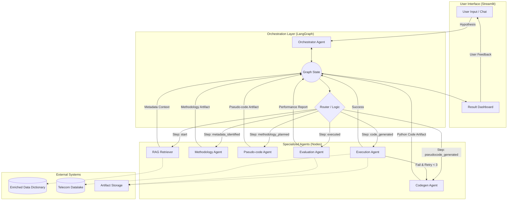

# HyTE: Technical Workflow & Architecture

This document provides a deep dive into the **HyTE (Hypothesis Testing Engine)** orchestration, explaining the flow of data, agent roles, and feedback loops.

## Core Workflow Diagram

The diagram below illustrates the stateful lifecycle of a hypothesis within the LangGraph framework.

## Detailed Node Explanation

### 1. Conversational Orchestrator (`orchestrator_agent.py`)
- **Role**: The "Decision Maker" and "Communicator".
- **Logic**: Uses the `messages` history and `current_step` to decide what to tell the user. It acts as the face of the system, hiding the complexity of node transitions.
- **State Impact**: Updates the message list and manages high-level transitions.

### 2. RAG Retriever (`rag_retriever.py`)
- **Role**: The "Librarian".
- **Logic**: Performs semantic search against table/column descriptions in the **Enriched Data Dictionary**.
- **Context**: Grounding. This prevents "hallucination" by forcing subsequent agents to use only the tables that actually exist.

### 3. Methodology Agent (`methodology_agent.py`)
- **Role**: The "Data Scientist".
- **Logic**: Designs a statistical approach (Markdown). It decides which variables to correlate, which filters to apply, and how to define a "rejection" vs "acceptance" of the hypothesis.

### 4. Pseudo-code Agent (`pseudocode_agent.py`)
- **Role**: The "Analyst/Architect".
- **Logic**: Acts as a bridge between abstract methodology and concrete code. It forces the system to "think" through the logical steps before writing Python code, which significantly reduces coding errors.

### 5. Code Gen Agent (`codegen_agent.py`)
- **Role**: The "Developer".
- **Logic**: Writes the final Python script. It is strictly constrained by the pseudo-code and the metadata context (table names).

### 6. Execution Agent (`execution_agent.py`)
- **Role**: The "Runtime Environment".
- **Logic**: Executes the code in a managed sandbox. 
- **Self-Correction**: If a syntax or logic error occurs, it sets the state to `execution_failed`, prompting the **Coder** to fix the issue based on the error trace.

### 7. Evaluation Agent (`evaluation_agent.py`)
- **Role**: The "QA Inspector".
- **Logic**: Reviews the final artifacts and the conversation. It scores the performance and provides suggestions for improving the prompts or adding data guardrails.

---

## Analysis & Improvement Opportunities

Based on this workflow, here are areas you can target to improve HyTE performance:

| Area | Strategy | Benefit |
| :--- | :--- | :--- |
| **Retrieval Accuracy** | Update `rag_retriever.py` to use a vector database (FAISS/Chroma) for faster/more semantic searches as your dictionary grows. | Better table selection for complex hypotheses. |
| **Code Robustness** | Add "Guardrails" in `codegen_agent.py` to always check for empty dataframes before performing calculations. | Fewer execution retries and faster results. |
| **Logic Alignment** | Update the `evaluation_agent.py` prompts to specifically check if the pseudo-code matches the methodology steps 1:1. | Higher integrity of the final analysis results. |
| **User Agency** | Add "Human-in-the-loop" break points in `hyte_graph.py` where the graph pauses for user approval of the methodology before moving to code gen. | Ensures user alignment before computationally expensive tasks. |
